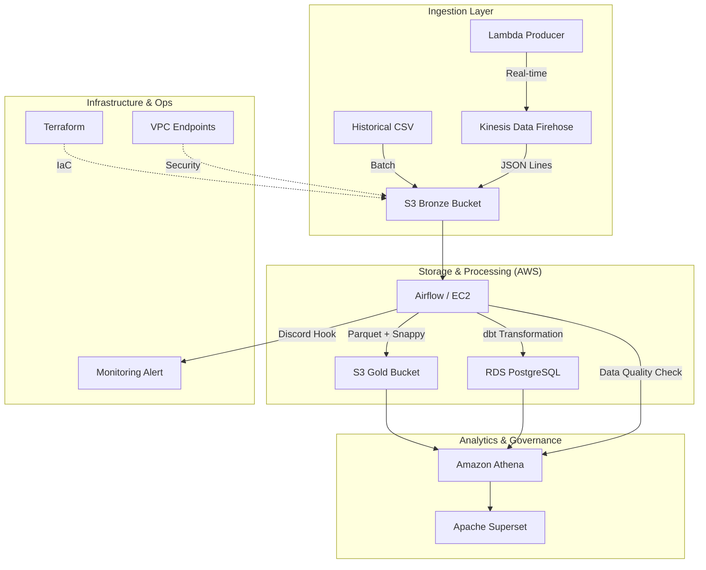

# 🚀 Olist E-Commerce: High-Performance Data Lakehouse on AWS
> An End-to-End Hybrid Data Platform (Batch & Streaming) using Medallion Architecture, AWS Serverless, and Production-Grade Orchestration.

---

## 🏗️ System Architecture
Hệ thống được thiết kế theo mô hình **Modern Data Lakehouse**, hội tụ dữ liệu từ hai luồng chính (Batch & Streaming) vào một trung tâm lưu trữ tập trung trên S3, được quản lý bằng Metadata chuẩn Glue Catalog.



---

## 🌟 Key Engineering Pillars (Senior Focus)

### 1. Hybrid Data Ingestion (Batch & Streaming)
- **Streaming:** Sử dụng **Kinesis Data Firehose** để ingest dữ liệu thời gian thực từ **Lambda Producer**. Firehose tự động thực hiện batching (1MB/60s) để tránh lỗi "Small Files Problem" trên S3.
- **Batch:** Ingest dữ liệu lịch sử từ PostgreSQL, đảm bảo tính nhất quán (Consistency) với dữ liệu mới.

### 2. Medallion Architecture & FinOps
- **Layering:** Dữ liệu được phân tầng nghiêm ngặt: **Bronze** (Raw) -> **Silver** (Staging) -> **Gold** (Analytics-Ready).
- **Format Optimization:** Lưu trữ tầng Gold dưới định dạng **Parquet (Columnar)** kết hợp nén **Snappy**, giảm 80% dung lượng và tăng tốc query 5x so với CSV.
- **S3 Lifecycle (FinOps):** Tự động chuyển dữ liệu Raw sang **Standard-IA** (30 ngày) và **Glacier** (180 ngày) để tối ưu chi phí lưu trữ thông qua **Terraform**.

### 3. Serverless Analytics & Performance
- **Athena Partition Projection:** Thay vì quét toàn bộ metadata, Athena được cấu hình để tự tính toán phân vùng dựa trên thời gian, giảm 90% lượng dữ liệu quét (Data Scanned).
- **Federated Query:** Kết nối trực tiếp S3 và RDS qua Athena, cho phép JOIN dữ liệu Master Data (Batch) và Real-time (Streaming) tại một điểm duy nhất.

### 4. Production-Grade Governance
- **Data Quality Framework:** Phát triển **Custom AthenaDataQualityOperator** trong Airflow để thực hiện kiểm tra Uniqueness, Completeness và Validity ngay trong Pipeline.
- **Security:** Triển khai **VPC Endpoints (S3 Gateway, Secrets Manager)** để traffic không bao giờ đi ra Internet, đảm bảo an toàn tuyệt đối cho dữ liệu.

---

## 🛠️ Tech Stack Matrix
| Category | Technology |
|---|---|
| **Cloud Provider** | Amazon Web Services (AWS) |
| **Infrastrucure** | Terraform (IaC), VPC, Security Groups, IAM |
| **Ingestion** | Kinesis Firehose, Lambda, Python |
| **Storage** | S3 (Bronze, Silver, Gold), RDS PostgreSQL |
| **Orchestration** | Apache Airflow (Dockerized on EC2) |
| **Transformation** | dbt (Data Build Tool) |
| **Query & Analytics** | Amazon Athena, Glue Data Catalog |
| **Visualization** | Apache Superset |
| **Observability** | Discord Webhook, CloudWatch |

---

## 📂 Detailed Documentation
Mỗi thành phần của hạ tầng được giải trình chi tiết kỹ thuật (Design Decisions) tại đây:
- [🔐 Networking & Security](./docs/01_networking_security/README.md)
- [📦 Storage & Data Lake](./docs/02_storage_layer/README.md)
- [⚡ Streaming Ingestion](./docs/03_streaming_ingestion/README.md)
- [🔍 Catalog & Query Engine](./docs/04_catalog_query/README.md)
- [⚙️ Orchestration & Analytics](./docs/05_orchestration_analytics/README.md)

---

## 🚀 Deployment Summary
### 1. Prerequisites
- AWS CLI configured with Admin permissions.
- Docker & Docker Compose installed.
- Terraform CLI installed.

### 2. Infrastructure Setup
```bash
cd terraform
terraform init
terraform apply -auto-approve
```

### 3. Application Launch
```bash
cp .env.example .env  # Update your AWS & DB Credentials
docker compose up -d
```

---

## 📈 Lessons Learned & Roadmap
- **Challenge:** Xử lý trùng lặp dữ liệu trong môi trường multi-item orders.
- **Solution:** Thiết kế kiến trúc định danh **Composite Key (order_id + item_id)** và tích hợp vào DQ Operator.
- **Future Roadmap:** 
  - Triển khai **Apache Spark** trên EMR để xử lý Large-scale Batch.
  - Tích hợp **Delta Lake** để hỗ trợ ACID transactions trên S3.

---
**Author:** Phan Tan Phat (philipsgn)  
**Role:** Data Engineer / AWS Solutions Architect  
*Built with passion for high-performance data systems.*
