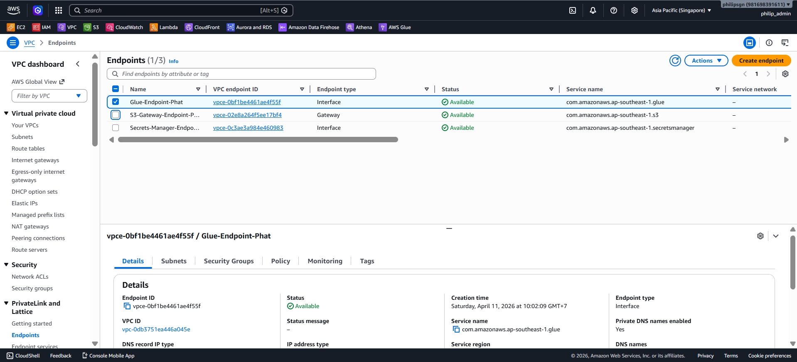
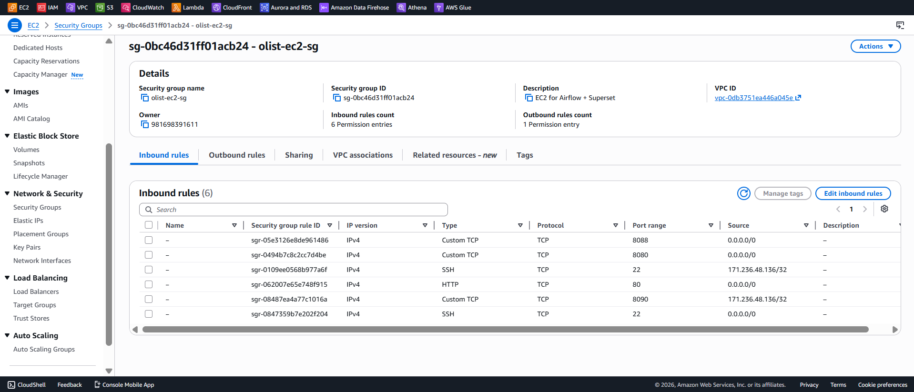
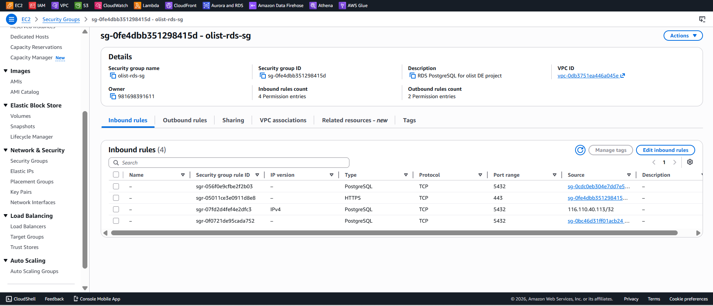
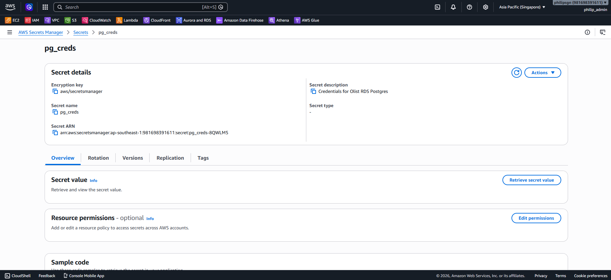

# 🔐 Networking & Security Strategy

## 1. VPC Architecture
Hệ thống không sử dụng Default VPC của AWS mà triển khai trên một **Custom VPC** để đảm bảo tính cô lập và kiểm soát hoàn toàn traffic.

### VPC Endpoints (AWS PrivateLink)
Đây là kỹ thuật nâng cao để tối ưu chi phí và bảo mật:
- **S3 Gateway Endpoint:** Cho phép Airflow EC2 và Glue giao tiếp với S3 thông qua mạng nội bộ của AWS. Điều này loại bỏ hoàn toàn phí NAT Gateway khi truyền tải dữ liệu lớn và giữ dữ liệu không bao giờ đi ra ngoài internet public.
- **Secrets Manager Endpoint:** Đảm bảo việc truy xuất mật khẩu Database (RDS) diễn ra an toàn qua mạng riêng.

## 2. Security Groups (Least Privilege)
Mô hình bảo mật "Zero Trust" ở mức Network:
- **RDS SG:** Chỉ chấp nhận kết nối từ Security Group của Airflow Instance. Ngay cả khi có mật khẩu, một người dùng bên ngoài cũng không thể kết nối tới Database.
- **EC2 SG:** Chỉ mở các cổng 8080 (Airflow), 8088 (Superset) và 22 (SSH). Các cổng này được giới hạn theo dải IP cụ thể (White-listing).

## 3. IAM & Secrets Management
- **IAM Roles:** Sử dụng IAM Instance Profile cho EC2 để tránh việc lưu trữ Access Key/Secret Key trong code.
- **Secrets Manager:** Lưu trữ RDS credentials, Discord Webhook URL. Code sẽ gọi API để lấy secret lúc runtime.

## 4. 📸 Screenshots

### VPC Endpoints

### Security Groups — EC2

### Security Groups — RDS

### Secrets Manager

