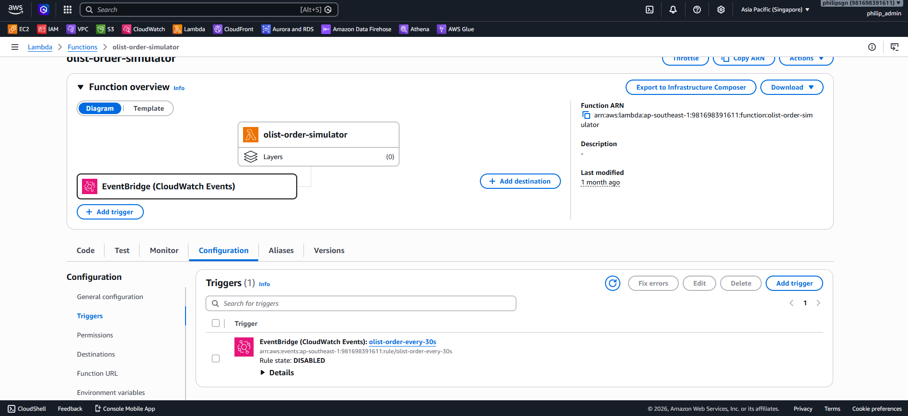
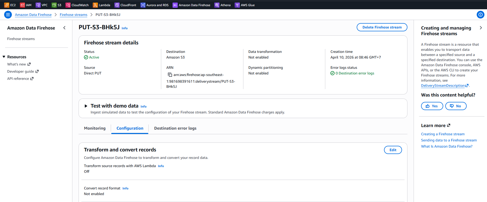
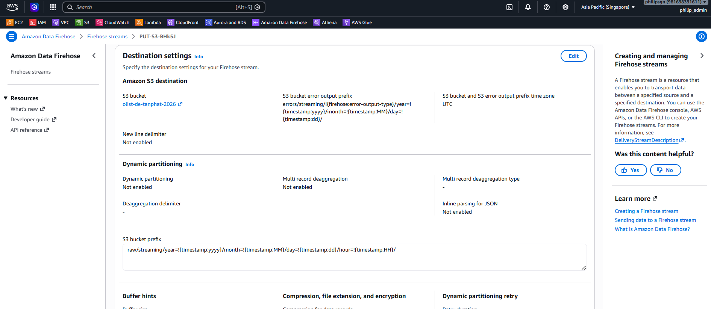
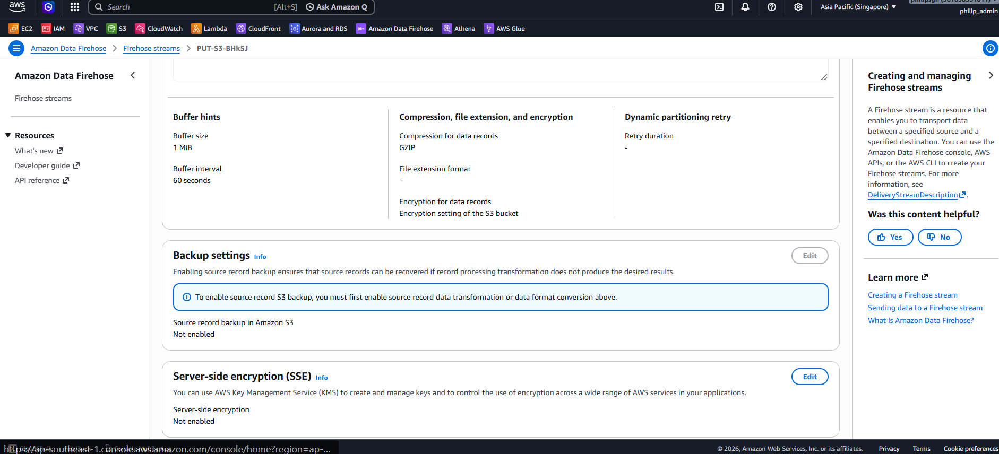
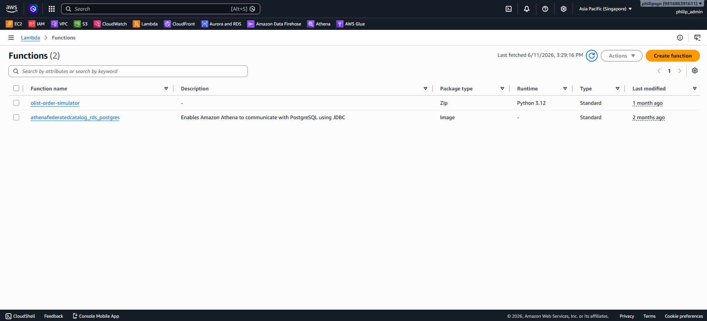
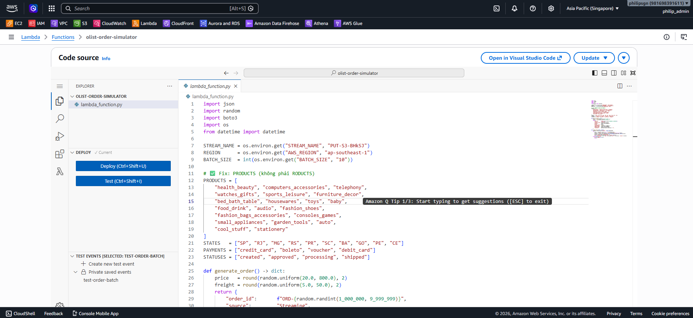

# ⚡ Streaming Ingestion Pipeline

## 1. Architecture
Pipeline này mô phỏng luồng giao dịch thời gian thực của sàn thương mại điện tử:
`Lambda (Producer) -> Kinesis Data Firehose -> S3 Raw`

- **Lambda Producer:** Được lập lịch bởi **EventBridge (mỗi 30 giây)** để tự động tạo ra các đơn hàng giả lập với Taxonomy chuẩn của Olist — số liệu trên Superset Dashboard sẽ tự động tăng theo thời gian thực.
- **Kinesis Firehose:** Đóng vai trò là "Buffer". Nó thu thập các sự kiện nhỏ và gộp chúng lại (Batching) theo thời gian (60s) hoặc dung lượng (1MB) trước khi ghi vào S3 để tránh hiện tượng "Small Files Problem".

## 2. Transformation
- Lambda thực hiện chuẩn hóa dữ liệu ngay lúc gửi (Timestamp format, Source tagging).
- Firehose tự động phân vùng dữ liệu trên S3 theo cấu trúc `year=YYYY/month=MM/day=DD/hour=HH`.

## 3. EventBridge Trigger (30s Schedule)

EventBridge Rule được cấu hình với lịch `rate(30 seconds)` để kích hoạt Lambda Producer tự động, giúp dữ liệu liên tục đổ vào Firehose → S3 → Dashboard mà không cần can thiệp thủ công.

## 4. 📸 Screenshots

### Kinesis Firehose Configuration

### Lambda Producer

