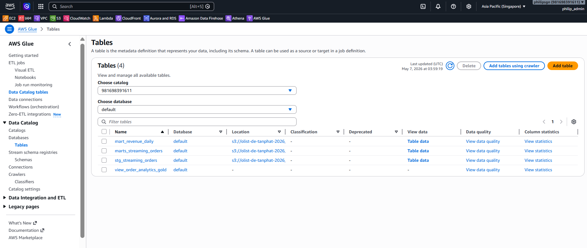
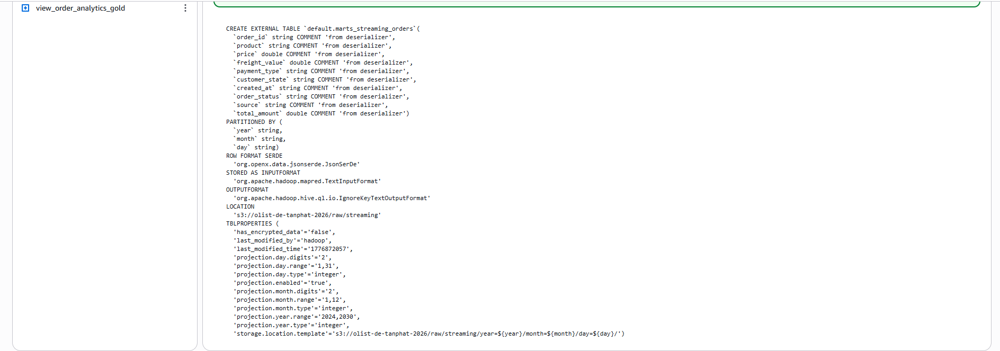
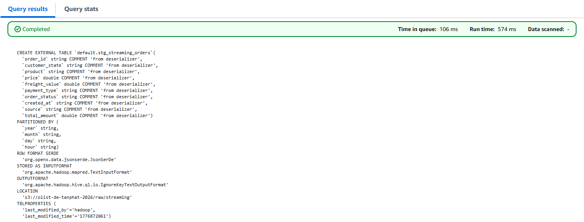
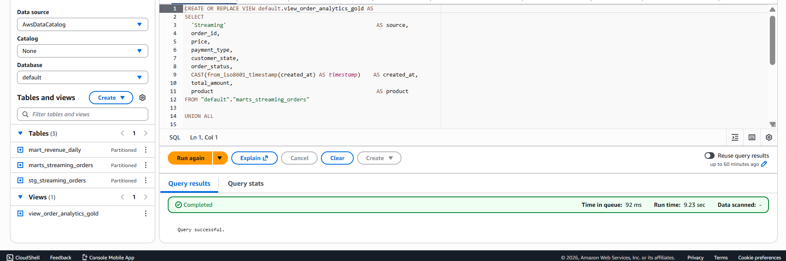
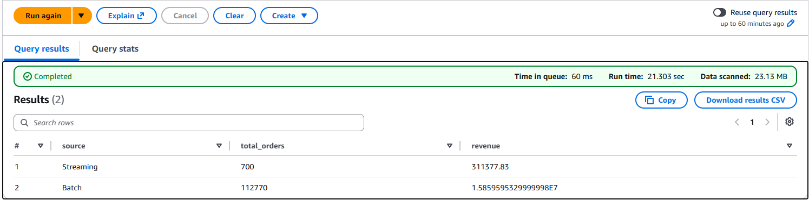
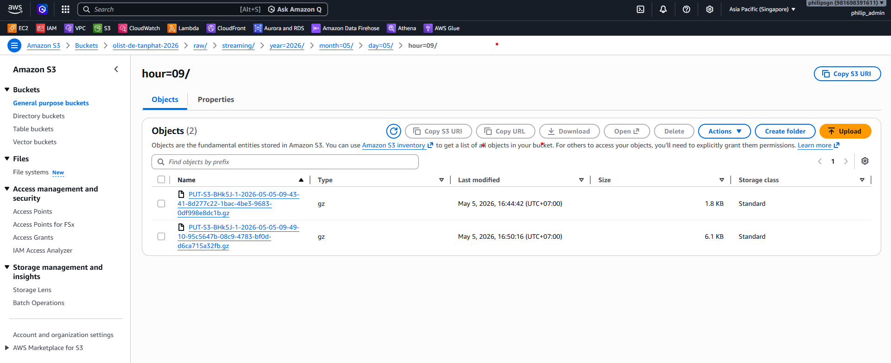

# 🔍 Data Catalog & Query Engine (Athena/Glue)

## 1. AWS Glue Data Catalog (The Metadata Store)
Trong kiến trúc này, Glue Data Catalog đóng vai trò là **Central Metadata Repository** cho toàn bộ Data Lake.
- **DDL-based Cataloging:** Thay vì sử dụng Glue Crawler (tốn chi phí và khó kiểm soát schema), dự án sử dụng **SQL DDL** để đăng ký bảng trực tiếp từ Athena. Điều này đảm bảo tính nhất quán của dữ liệu (Data Consistency) và phù hợp với quy trình CI/CD.
- **Serverless Metadata:** Mọi định nghĩa về bảng và view được lưu trữ bền vững tại Glue, cho phép các dịch vụ khác (như Amazon EMR hoặc Redshift Spectrum) có thể truy cập cùng một nguồn dữ liệu trong tương lai.

## 2. Amazon Athena & Performance Tuning (The Query Engine)
- **Partition Projection (Senior Technique):** Đây là điểm mấu chốt. Thay vì dựa vào việc đăng ký phân vùng thủ công trong Glue (qua `MSCK REPAIR TABLE`), dự án cấu hình Athena để tự động tính toán vị trí dữ liệu trên S3 dựa trên cấu trúc thư mục thời gian.
  - **Lợi ích:** Loại bỏ độ trễ khi chờ Crawler chạy, giảm thiểu lỗi "Missing Partitions" và tối ưu hóa tốc độ truy vấn đáng kể.
- **Federated Query:** Sử dụng Athena Lambda Connector để truy vấn chéo giữa S3 và RDS PostgreSQL. Điều này giúp hệ thống đạt được kiến trúc **Hybrid Data Lakehouse**, nơi dữ liệu lịch sử và dữ liệu thời gian thực được hội tụ tại một điểm truy vấn duy nhất.

## 3. Data Schema: view_order_analytics_gold
Dữ liệu tại tầng Analytics (Gold) được thiết kế để phục vụ Superset với cấu trúc cột thống nhất:

| Cột | Kiểu | Mô tả |
|---|---|---|
| `source` | varchar | 'Streaming' hoặc 'Batch' |
| `order_id` | varchar | ID đơn hàng gốc |
| `item_id` | varchar | ID món hàng (Định danh Unique grain cho DQ Check) |
| `price` | double | Giá niêm yết của sản phẩm |
| `payment_type` | varchar | Phương thức thanh toán |
| `customer_state` | varchar | Bang của khách hàng (Brazil) |
| `order_status` | varchar | Trạng thái đơn hàng |
| `created_at` | timestamp | Thời gian giao dịch |
| `total_amount` | double | Tổng thanh toán (Price + Freight) |
| `product` | varchar | Danh mục sản phẩm (Olist Taxonomy) |

## 4. 📸 Screenshots & Verification

### 🔹 AWS Glue Data Catalog — Tables
Hiển thị danh sách các bảng được đăng ký thông qua DDL. Mọi Metadata được quản lý tập trung tại đây.

### 🔹 Partition Projection — marts_streaming_orders
Bằng chứng cấu hình Senior trong phần `TBLPROPERTIES`. Athena tự động tính toán đường dẫn S3 mà không cần quét Metadata Store.

### 🔹 Partition Projection — stg_streaming_orders

### 🔹 Athena Query Editor
Federated Query chéo giữa S3 Data Lake và RDS PostgreSQL tại một điểm truy vấn duy nhất.

### 🔹 Athena Performance — Data Scanned
Chứng minh hiệu quả chi phí: Truy vấn hàng ngàn dòng dữ liệu nhưng chỉ quét vài KB nhờ kỹ thuật phân vùng thông minh.

### 🔹 S3 Physical Storage Structure
Cấu trúc thư mục thực tế trên S3 tuân thủ nghiêm ngặt định dạng `key=value` để tối ưu cho việc truy vấn.

