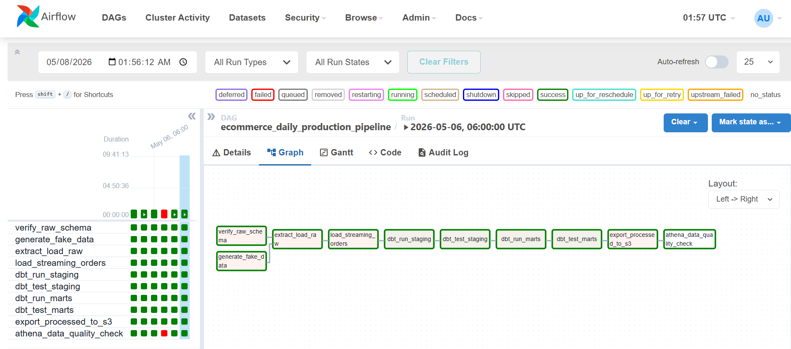
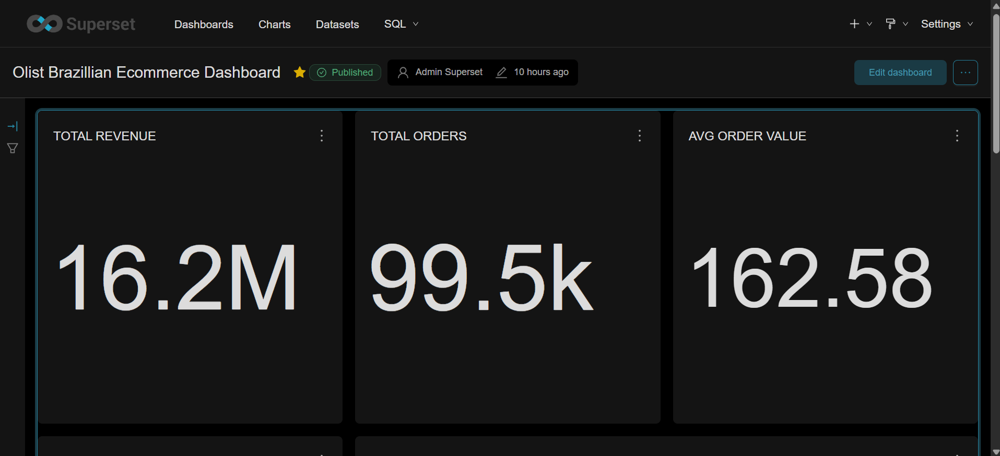
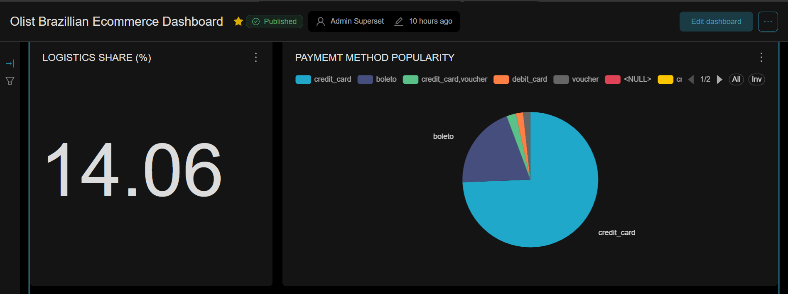
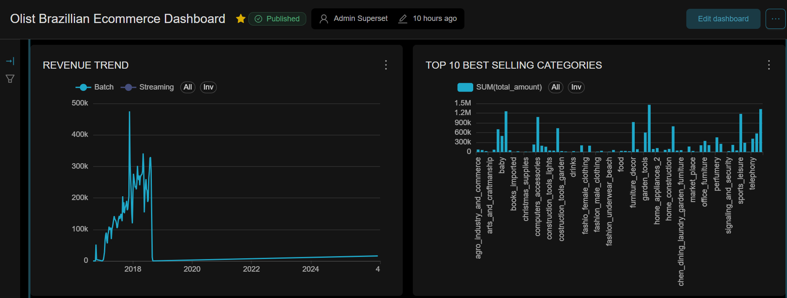
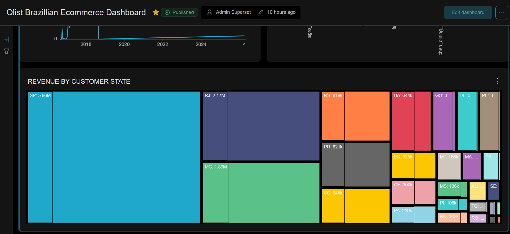
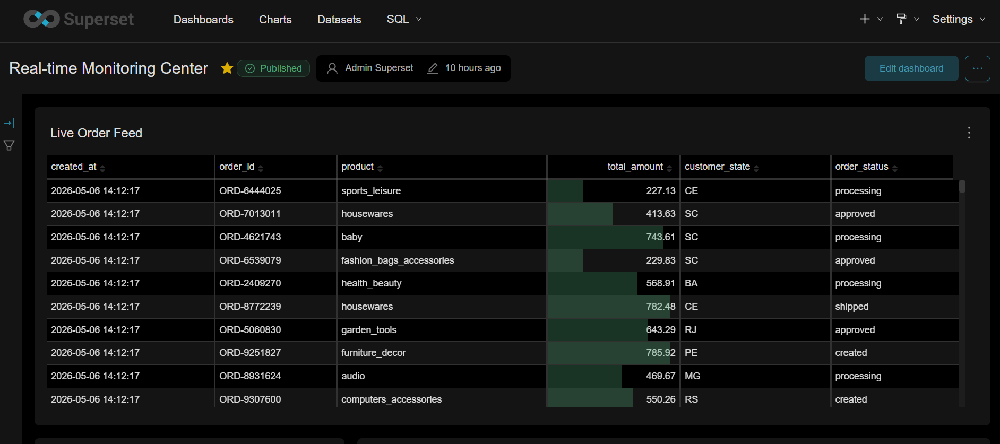
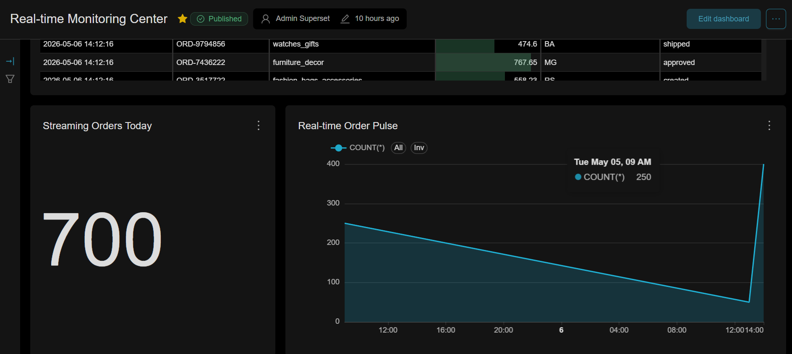
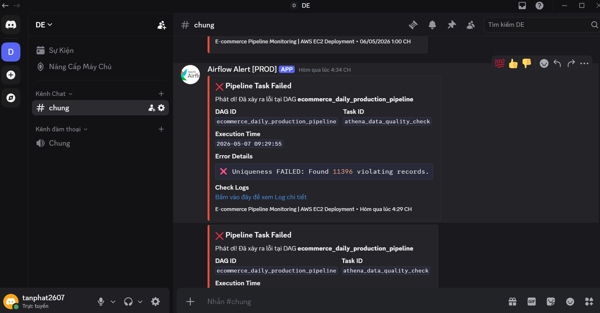

# ⚙️ Orchestration & Visualization

## 1. Airflow Orchestration
Airflow được triển khai trên EC2 bằng Docker. Nó quản lý các tác vụ phức tạp:
- Trigger dbt để transform dữ liệu.
- Export dữ liệu từ PostgreSQL sang S3 Gold layer.
- **Athena Data Quality Operator:** Một Custom Operator do tôi phát triển để chạy các bài test chất lượng dữ liệu ngay trên Athena sau mỗi lần pipeline chạy.

## 2. dbt (Data Build Tool)
Sử dụng mô hình Medallion để transform dữ liệu trong PostgreSQL. 
- **Models:** Tách biệt Staging và Marts.
- **Tests:** Đảm bảo tính toàn vẹn của dữ liệu tại tầng PostgreSQL.

## 3. Advanced Data Quality (Athena Operator)
Thay vì sử dụng các công cụ DQ bên thứ 3, dự án triển khai một **Custom AthenaDataQualityOperator**.
- **Composite Key Validation:** Hệ thống kiểm tra tính duy nhất dựa trên tổ hợp `order_id + item_id + source + created_at`. Điều này cho phép xử lý chính xác các đơn hàng có nhiều món (multi-item orders) mà vẫn phát hiện được các dòng dữ liệu rác/trùng lặp.
- **Immediate Failure & Alerting:** Nếu phát hiện bất kỳ dòng dữ liệu nào vi phạm (bad_count > 0), Task sẽ chủ động Raise Exception để dừng Pipeline và gửi thông báo khẩn cấp qua Discord.

## 4. Apache Superset Dashboard
Dashboard cung cấp cái nhìn 360 độ về doanh nghiệp:
- **Revenue Analytics:** Xu hướng doanh thu theo ngày/tháng.
- **Logistics Performance:** Phân tích Freight cost và Delivery time.
- **Product Insights:** Top sản phẩm bán chạy nhất từ cả nguồn Batch và Streaming.

## 5. 📸 Screenshots

### Airflow DAG

### Superset Dashboard

### Discord Alerting

