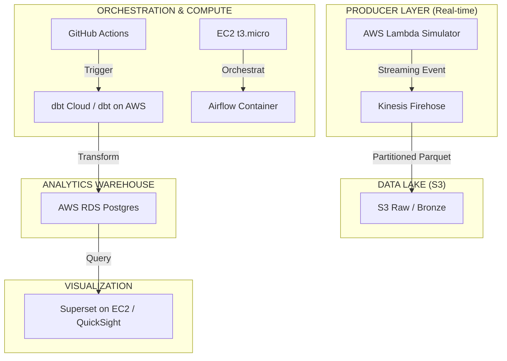

# ☁️ AWS Cloud Upgrade Roadmap (V2.0 - Production Architecture)

**Mục tiêu**: Nâng cấp dự án Olist lên Cloud trong 14 ngày. Xây dựng hệ thống **Real-time Streaming** và **Medallion Architecture** (Bronze/Silver/Gold) chuẩn doanh nghiệp lớn.

---

## 🏛️ 1. Kiến trúc Cloud "Heavyweight" (Tối ưu CV & Chi phí)

---

## 📅 2. KẾ HOẠCH 14 NGÀY CHI TIẾT

### Tuần 1: Cloud Foundations & Ingestion
- **Ngày 1 (Budget & S3)**: Setup **AWS Budget Alert 10$**. Tạo S3 Bucket với phân cấp folder **Hive-style** (`/year=/month=/day=`).
- **Ngày 2 (Relational Cloud)**: Khởi tạo **RDS Postgres (Free Tier)**. Di chuyển schema `raw`, `staging`, `marts` từ local lên Cloud. Update `profiles.yml`.
- **Ngày 3 (Transformation Cloud)**: Kết nối **dbt Cloud** với RDS. Chạy thành công con số doanh thu thực từ S3 nạp vào RDS.
- **Ngày 4 (Serverless Stream)**: Viết **Lambda Function** (IAM Role based) bắn đơn hàng mới qua **Kinesis Firehose**. Dữ liệu chảy vào S3 tự động dưới dạng nén **Parquet**.
- **Ngày 5-7 (Cloud Orchestration)**: Launch **EC2 t3.micro**. Cài đặt Airflow + Docker. Chuyển đổi toàn bộ logic DAG từ local lên mây.

### Tuần 2: Optimization & DataOps
- **Ngày 8 (Performance)**: Triển khai **Incremental Loading** thực thụ trên Cloud. Tối ưu hóa Indexing trên RDS.
- **Ngày 9 (CI/CD Production)**: Hoàn thiện **GitHub Actions**. Tự động test dbt mỗi khi có thay đổi code.
- **Ngày 10 (Observability)**: Tích hợp **Telegram Bot Alerting**. Pipeline fail hoặc dbt test fail sẽ báo ngay về điện thoại.
- **Ngày 11 (Data Catalog)**: Dùng **AWS Glue Crawler** để catalog dữ liệu trên S3. Mở rộng khả năng truy vấn bằng Amazon Athena.
- **Ngày 12 (Security Hardening)**: Review IAM Policies, đóng các port không cần thiết trên Security Group.
- **Ngày 13 (Tài liệu & CV)**: Quay video demo Dashboard nhảy số. Viết README pro gồm Architecture Diagram.
- **Ngày 14 (Review & Cleanup)**: Tổng duyệt và tối ưu hóa chi phí (Stop/Terminate các resource không dùng).

---

## 🛡️ 3. CHIẾN THUẬT "SỨC NẶNG CV" (Để HR không thể bỏ qua)

1.  **Security-First**: Sử dụng **IAM Roles & Security Groups** thay vì Root access.
2.  **Streaming & Batch Hybrid**: Chứng minh khả năng xử lý cả dữ liệu tĩnh (CSV cũ) và dữ liệu động (Lambda Stream).
3.  **Cost Awareness**: Phỏng vấn hãy nói về việc em đã tự tay tối ưu chi phí (dùng t3.micro thay vì MWAA) để tiết kiệm hàng triệu đồng cho công ty.
4.  **Idempotency**: Đảm bảo Pipeline có thể chạy lại N lần mà kết quả không bị sai lệch.

---

🚀 **TRẠNG THÁI**: Sẵn sàng thực thi Ngày 1.
> [!IMPORTANT]
> TUYỆT ĐỐI KHÔNG TẠO MWAA HOẶC REDSHIFT NẾU KHÔNG MUỐN "CHÁY" 200$ TRONG 1 TUẦN.
