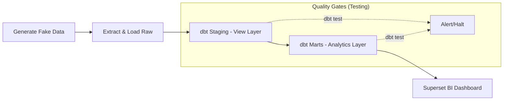

# 🏭 E-commerce Data Platform: Operation & Monitoring Guide

Tài liệu này hướng dẫn cách vận hành và giám sát hệ thống dữ liệu từ đầu đến cuối (End-to-End). Dự án được thiết kế theo quy trình **Gated Production Pipeline** đảm bảo dữ liệu luôn sạch và chính xác.

---

## 🏗️ 1. Kiến trúc luồng dữ liệu (Data Flow)



---

## 🛠️ 2. Quy trình vận hành (SOP)

### Bước 1: Khởi động hệ thống (Infrastructure)
Docker Desktop phải được bật. Tại thư mục gốc, chạy lệnh:
```bash
docker compose up -d
```
Đảm bảo các container: `postgres`, `airflow-worker`, `superset` đều trong trạng thái **Running**.

### Bước 2: Kích hoạt Pipeline (Airflow Orchestration)
Truy cập: `http://localhost:8080` (Crendentials: `airflow/airflow`).
1. Tìm DAG: `ecommerce_daily_production_pipeline`.
2. Bật (Unpause) DAG.
3. Nhấn nút **Trigger DAG** (Play button) để bắt đầu.

### Bước 3: Giám sát thực thi (Observation)
Trong giao diện Airflow, click vào các Task để kiểm tra:
- **`generate_fake_data`**: Kiểm tra Logs để xác nhận 100 đơn hàng mới đã được sinh ra.
- **`extract_load_raw`**: Xác nhận dữ liệu được nạp thành công vào Postgres.
- **`dbt_run_marts`**: Kiểm tra thời gian thực thi (Performance) và các bước indexing.

### Bước 4: Kiểm tra dữ liệu (Database Validation)
Mở pgAdmin 4 hoặc công cụ SQL khác, kết nối database `ecommerce_db`:
```sql
-- Kiểm tra đơn hàng của ngày hôm nay (Dữ liệu do script sinh ra)
SELECT order_date, COUNT(*) 
FROM marts.mart_revenue_daily 
WHERE order_date = CURRENT_DATE
GROUP BY 1;
```

### Bước 5: Phân tích & Trực quan (BI Sync)
Truy cập: `http://localhost:8088` (Crendentials: `admin/admin123`).
1. Vào mục **Dashboards**.
2. Chọn Dashboard dự án.
3. Nhấn **Refresh Dashboard** để thấy dữ liệu mới nhất được cập nhật tự động.

---

## 🚨 3. Xử lý sự cố (Troubleshooting)

- **Dag bị Đỏ (Failed)**: Click vào task lỗi -> chọn **Logs**.
- **Lỗi dbt test**: Nếu một bài test unique key bị lỗi, hãy kiểm tra lại dữ liệu thô. Pipeline sẽ dừng để tránh làm sai báo cáo doanh thu.
- **SLA Alert**: Nếu DAG chạy quá 2 giờ, hệ thống sẽ tự động bắn cảnh báo SLA (Service Level Agreement).

---

🚀 **Project Status**: `PRODUCTION READY` | `DYNAMIC DATA ENABLED`
