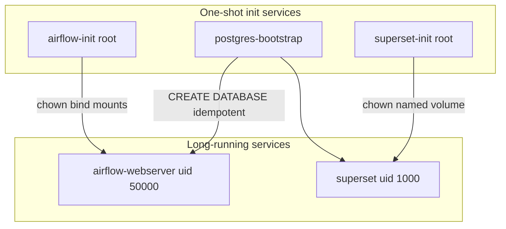

# Zero-Touch Deployment Architecture

This document explains how the platform removes manual SSH fixes (`chmod 777`, `chown`, database creation) after each GitHub push.

## Problem: Host OS vs Container UID Mismatch

Docker bind-mounts expose **host paths** into containers. Files created on the host (e.g. by user `ubuntu` during CI rsync) are owned by UID `1000`. Airflow containers run as `AIRFLOW_UID=50000`. Superset runs as UID `1000` inside the image but cannot write to host directories owned by root or another UID.

Running application containers as `root` avoids permission errors but violates container security best practices.

## Solution Overview



| Component | Mechanism | Why it works |
|-----------|-----------|--------------|
| **Airflow** | `airflow-init` (root) + bind mounts | Creates dirs and `chown`s to `AIRFLOW_UID` before scheduler/webserver start |
| **Superset** | Named volume `superset_home` + `superset-init` | Writable state stays in Docker-managed storage, not host `./superset_home` |
| **Superset drivers** | `Dockerfile.superset` build-time `pip install` | No runtime pip cache on read-only or wrong-owned paths |
| **RDS metadata DB** | `postgres-bootstrap` | Idempotent `CREATE DATABASE` for `airflow` and `superset` before apps connect |
| **CI/CD** | `.github/workflows/deploy.yml` | Only rsync → `compose down` → `compose up`; init logic lives in Compose |

## 1. Superset: Named Volume + Init (No Root)

- **Before:** `./superset_home` bind mount + `user: root` + runtime `pip install` → permission denied loops.
- **After:**
  - `superset_home` is a **named volume** owned by UID `1000` after `superset-init`.
  - `Dockerfile.superset` installs `psycopg2-binary` and `pyathena` at **image build**.
  - Main `superset` service runs as the image default non-root user.

Config remains bind-mounted read-only: `./superset/superset_config.py`.

## 2. Airflow: Init Container Pattern

`airflow-init` runs once per `docker compose up`:

1. `mkdir -p` on all bind-mounted paths.
2. `chown -R ${AIRFLOW_UID}:${AIRFLOW_GID}` and `chmod ug+rwX`.

Airflow services use `depends_on: airflow-init: condition: service_completed_successfully`.

## 3. Postgres / RDS: Bootstrap Client

`postgres-bootstrap` connects to `POSTGRES_HOST` (local `postgres` service or AWS RDS endpoint from `.env`):

- Retries until Postgres is reachable (works for RDS without waiting on local `postgres`).
- Creates `POSTGRES_AIRFLOW_DB` and `POSTGRES_SUPERSET_DB` only if missing.

**Production `.env` example:**

```bash
POSTGRES_HOST=your-rds.region.rds.amazonaws.com
POSTGRES_SSLMODE=require
```

Local dev keeps `POSTGRES_HOST=postgres` and `POSTGRES_SSLMODE=prefer`.

## 4. Self-Healing Deploy Flow

1. GitHub Actions **rsync**s code (preserves EC2 `.env`).
2. `docker compose down --remove-orphans`
3. `docker compose up -d --build`
4. Init services run → exit 0 → application services start with correct permissions and databases.

No SSH steps for permissions or database creation.

## Operational Notes

- **First-time EC2:** Create `.env` once with secrets (not in git). All other setup is automated.
- **Named volumes** persist across deploys (`superset_home`, `postgres_data`). `compose down` does not remove them unless you add `-v`.
- **Compose version:** `depends_on.required: false` requires Docker Compose v2.20+ (standard on current Ubuntu EC2 images).
